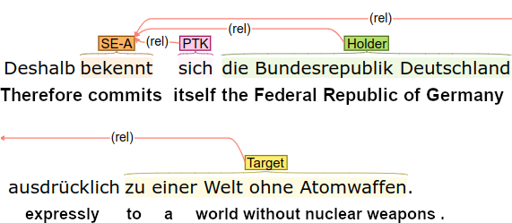

# GePaDe-ORL

This repository contains the data and supplementary materials for our [ParlaCLARIN-2024 paper](https://github.com/umanlp/spkatt/blob/master/docs/parlaclarin-2024-rehbein-ponzetto-ORL.pdf).




The repository contains the GePaDe-ORL corpus, with manual annotations of subjective expressions and their opinion holders and targets.

## Data

<p>The data is available in json format.</p>

<p>The json dictionary includes the annotations for 13,222 sentences/clauses. For each sentence, we add the list of tokens (word forms) and lemmas (automatically predicted using [spacy]()) and an annotation dictionary that encodes whether this sentence includes a subjective expression and, if true, the token position of the subjective expression, its view (either Agent, Patient or Speaker view) and a list with role annotations for each sentence token.
</p>

<p><b>Example:</b></p>

```
   "20003_Zusatzpunkt_2_FDP_Brandenburg_ID20306600_18.11.2021-5": {
      "words": [
         "Sie",
         "litten",
         "oftmals",
         "unter",
         "sozialer",
         "Isolation",
         "und",
         "unter",
         "Bewegungsmangel",
         "."
      ],
      "lemmas": [
         "sie",
         "leiden",
         "oftmals",
         "unter",
         "sozial",
         "Isolation",
         "und",
         "unter",
         "Bewegungsmangel",
         "--"
      ],
      "annotations": {
         "1": {
            "predicate": "SE-A",
            "roles": [
               "B-Holder",
               "B-V",
               "_",
               "B-Target",
               "I-Target",
               "I-Target",
               "I-Target",
               "I-Target",
               "I-Target",
               "_"
            ]
         }
      }
   }
```

The example above encodes a sentence where "leiden" (suffer) triggers a subjective expression with Agent view (Agent view: the agent of the sentence is the opion holder while the Patient encodes the target of the opinion).
The key of the "annotations" dictionary points to the token at position "1" (the verb "leiden") and the role list states for each sentence token whether it fills a role for the respective subjective expression or not.
We use the BIO scheme to mark the beginning of a multiword role. "B-V" marks the position of the subjective expression.


<table text-align="right">
<th align="right">
<td>Agent</td>
<td>Patient</td>
<td>Speaker</td>
<td>Total</td>
</th>
<tr align="right">
<td align="left">SE</td><td>2,325</td><td>138</td><td>859</td><td>3,322</td>
</tr>
<tr align="right">
<td align="left">Roles (all)</td><td>4,594</td><td>278</td><td>1,503</td><td>6,375</td>
</tr>
<tr align="right">
<td align="left">Target</td><td>2,422</td><td> 109</td><td> 752</td><td> 3,283</td>
</tr>
<tr align="right">
<td align="left">Holder</td><td> 1,998</td><td> 116</td><td> 12</td><td> 2,126</td>
</tr>
<tr align="right">
<td align="left">Other</td><td> 1</td><td> 0</td><td> 643</td><td> 644</td>
</tr>
<tr align="right">
<td align="left">PTC</td><td> 142</td><td> 4</td><td> 53</td><td> 199</td>
</tr>
<tr align="right">
<td align="left">SVC</td><td> 31</td><td> 5</td><td> 38</td><td> 74</td>
</tr>
<tr align="right">
<td align="left">Effect</td><td> 0</td><td> 44</td><td> 5</td><td> 49</td>
</tr>
</table> 

## License

<a rel="license" href="http://creativecommons.org/licenses/by-nc-sa/4.0/"></a><br />This work is licensed under a <a rel="license" href="http://creativecommons.org/licenses/by-nc-sa/4.0/">Creative Commons Attribution-NonCommercial-ShareAlike 4.0 International License</a>.

## Referencing

If you're using this data, please cite the following paper: 

```
@InProceedings{,
  author    = {Ines Rehbein  and  Ponzetto, Simone Paolo},
  title     = {A New Resource and Baselines for Opinion Role Labelling in German Parliamentary Debates},
  booktitle = {Proceedings of the },
  month     = {May},
  year      = {2024},
  address   = {Torino, Italia},
  publisher = {Association for Computational Linguistics},
  pages     = {},
  url       = {http://www.aclweb.org/anthology/}
}
```


